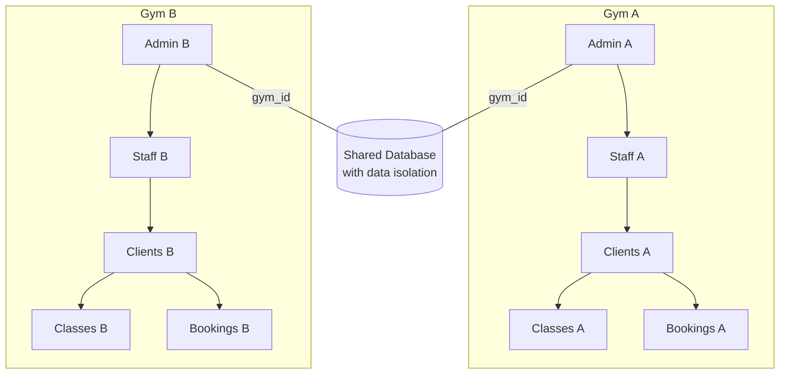

# Multi-Gym SaaS Platform Implementation Plan

## Overview
Transform the current gym management system into a multi-tenant SaaS platform where each gym operates independently with isolated data.

## Architecture



## Data Model Changes

### 1. Gym Model (New)
```
gyms
├── id (bigint, PK)
├── name (string)
├── slug (string, unique)
├── address (text)
├── phone (string)
├── email (string)
├── logo (string, nullable)
├── is_active (boolean)
├── created_at (timestamp)
├── updated_at (timestamp)
```

### 2. User Model (Modified)
```
users table additions:
├── gym_id (bigint, FK -> gyms.id, nullable)
└── role (enum: 'admin', 'staff', 'client')
```

### 3. GymClass Model (Modified)
```
gym_classes table additions:
└── gym_id (bigint, FK -> gyms.id)
```

### 4. ClassBooking Model (Modified)
```
class_bookings table additions:
└── gym_id (bigint, FK -> gyms.id)
```

## Implementation Steps

### Phase 1: Database & Models

1. **Create Gym Model & Migration**
   - Create `app/Models/Gym.php`
   - Create migration `database/migrations/xxxx_xx_xx_create_gyms_table.php`

2. **Update User Model**
   - Add `gym_id` foreign key
   - Add `staff` role enum
   - Add relationships: `gym()`, `staffMembers()`, `clients()`
   - Add scopes: `forGym()`, `staff()`, `clients()`

3. **Update GymClass Model**
   - Add `gym_id` foreign key
   - Add relationship: `gym()`
   - Add scope: `forGym()`

4. **Update ClassBooking Model**
   - Add `gym_id` foreign key
   - Add relationship: `gym()`
   - Add scope: `forGym()`

### Phase 2: Registration Flow

1. **Modify CreateNewUser (Fortify)**
   - When first user registers → create gym → assign gym_id
   - Admin role gets gym ownership

2. **Modify ClientRegisterController**
   - Admins can register clients for their gym
   - Staff registration for gym admin

### Phase 3: Authentication & Authorization

1. **Update Middleware**
   - Modify `AdminMiddleware` to check gym ownership
   - Create `GymAdmin` middleware for gym-specific admin

2. **Update Controllers**
   - Filter all queries by `gym_id` based on authenticated user
   - GymClassController: scope to user's gym
   - UserApprovalController: scope to user's gym

### Phase 4: Admin UI

1. **Gym Management**
   - Gym settings page (name, address, phone, logo)
   - View/edit gym details

2. **Staff Management**
   - Add staff members to gym
   - Remove staff from gym
   - Staff list view filtered by gym

3. **Client Management**
   - Filter clients by gym
   - Approve/disapprove clients within gym

### Phase 5: Testing

1. Verify data isolation between gyms
2. Test registration flow
3. Test admin permissions
4. Test class booking with gym isolation

## Key Files to Modify

| File | Action |
|------|--------|
| `app/Models/Gym.php` | Create |
| `app/Models/User.php` | Modify - add gym_id, relationships |
| `app/Models/GymClass.php` | Modify - add gym_id, relationships |
| `app/Models/ClassBooking.php` | Modify - add gym_id, relationships |
| `app/Actions/Fortify/CreateNewUser.php` | Modify - create gym for first user |
| `app/Http/Controllers/ClientRegisterController.php` | Modify - gym association |
| `app/Http/Controllers/GymClassController.php` | Modify - filter by gym |
| `app/Http/Controllers/Admin/UserApprovalController.php` | Modify - filter by gym |
| `app/Http/Middleware/AdminMiddleware.php` | Modify - gym ownership check |
| `routes/web.php` | Modify - add gym routes |
| `database/migrations/` | Add new migrations |

## User Roles

| Role | Description | Permissions |
|------|-------------|-------------|
| `admin` | Gym owner | Full access to own gym, manage staff, clients, classes |
| `staff` | Gym employee | View/manage classes, view clients |
| `client` | Gym member | Book classes, view own profile |

## Data Isolation Rules

- All queries must be scoped by `gym_id`
- Users can only see data from their gym
- Admins can only manage their own gym
- API endpoints validate gym membership
